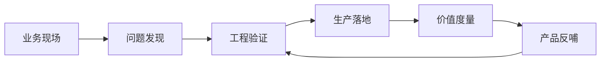

# FDE 到底是什么？

一个 AI 客服助手上线以后，客户最开始很兴奋。

演示时，它能回答政策问题，能总结工单，能生成回复草稿。项目群里所有人都觉得，这次应该能真正提效了。

但两周后，一线客服还是在群里问：“这个订单到底能不能退？”

系统有了，流程还在群里跑；看板有了，决策还是靠 Excel；AI 助手演示得很聪明，一到真实权限、真实数据、真实责任，就开始失灵。

很多企业软件项目最尴尬的地方，不是没有上线，而是上线之后没有真正改变工作。

系统有了，流程还在群里跑；看板有了，决策还是靠 Excel；AI 助手演示得很聪明，一到真实权限、真实数据、真实责任，就开始失灵。

FDE 的出现，本质上就是企业软件交付方式被逼到这一步之后长出来的新角色。过去很多企业软件默认一个前提：产品团队把通用能力做出来，客户通过配置、培训和实施完成落地。这个模式在标准化场景里有效，但一旦进入复杂组织，就会遇到最后一公里：数据散在多个系统里，流程藏在部门协作里，权限和审计限制了集成方式，一线用户真正关心的也不是“有没有某个功能”，而是审批能不能更快、风险能不能更早暴露、决策能不能更稳定。

FDE，Forward Deployed Engineering，就是在这个断点上出现的。

> **FDE 不是把产品送到现场，而是把现场变成产品继续进化的来源。**

## 一句话定义

从定义上看，FDE 指的是一种前沿部署工程实践：工程团队不只在产品研发后端工作，而是前移到客户现场，参与问题识别、方案验证、系统集成、生产化落地和产品反哺。它既是一类岗位，也是一种交付组织方式。

它不是一个更时髦的岗位名称，也不是“售前 + 工程师 + 顾问”的简单拼装。更准确地说，FDE 是一种把工程能力前移到真实业务现场的工作方式：工程师进入客户环境，面对不完整的信息、真实的系统约束和生产责任，把模糊但高价值的问题推进为可运行、可观测、可治理、可演进的系统。

因此，一个完整的 FDE 概念至少包含四个要素：真实业务现场、工程实现能力、生产责任意识、产品化反馈机制。少了现场，它会变成普通研发；少了工程，它会变成咨询；少了生产责任，它会停在 Demo；少了产品反哺，它又会滑向一次性定制。

简单说，FDE 不是只把软件交给客户，而是把软件能力真正带进客户的工作流里。

## 为什么需要这样的角色？

企业技术项目里有一个长期存在的断裂。

产品团队离现场太远，看到的往往是抽象需求；咨询团队可能很懂业务，但离代码和生产系统太远；实施团队能把系统上线，但通常只能围绕既定范围执行；客户自己最懂现场问题，却未必能把问题翻译成工程方案。

结果就是：很多系统“上线了”，但没有真正改变工作方式；很多 AI Demo “跑通了”，但进不了生产流程；很多客户需求“收集了”，但没有沉淀成可复用的产品能力。

FDE 连接的正是这些断点。

它站在业务现场、工程实现、产品路线和业务结果之间，不只负责把一个功能做出来，更负责回答几个更难的问题：

- 这个问题是不是真问题？
- 它在客户现场的流程里到底发生在哪里？
- 哪些部分应该用产品能力解决，哪些部分需要现场集成？
- 这个 Demo 如何验证关键假设？
- 如果进入生产，数据、权限、稳定性、审计和接管怎么办？
- 这次现场经验能不能反哺成产品或平台能力？

这也是为什么 FDE 的核心不只是“会写代码”，而是能把代码、系统、业务语境和组织协作放在同一张图里看。

| 传统断点 | 常见表现 | FDE 介入的方式 |
| --- | --- | --- |
| 产品离现场远 | 做了功能，但用户流程没变 | 把现场流程和产品能力重新对齐 |
| 咨询离代码远 | 方案讲清楚了，但系统没跑起来 | 把判断变成可验证的工程实现 |
| 实施离路线远 | 项目上线了，但经验没有沉淀 | 把客户现场反馈带回产品和平台 |
| 客户离工程远 | 痛点真实，但说不成需求 | 把业务语言翻译成系统边界和验证计划 |

## FDE 的三个关键词

理解 FDE，可以抓住三个关键词：现场、工程、闭环。

**现场**意味着 FDE 面对的不是干净的需求文档，而是真实组织里的复杂性。这里有遗留系统、人工流程、临时表格、权限边界、部门目标差异，也有很多只有一线人员才知道的隐性规则。FDE 要先读懂这些现场事实，再决定技术怎么进入。

**工程**意味着 FDE 不能停在诊断和方案。它需要构建原型、接入数据、设计接口、验证假设、处理异常，并理解一个系统从 Demo 到生产之间的距离。没有工程闭环，FDE 很容易退化成咨询；只有工程实现但不理解现场，又容易变成盲目的定制开发。

**闭环**意味着 FDE 的工作不以“功能交付”结束。真正的闭环包括：问题发现、工程交付、生产运行、价值度量和产品反哺。一个 FDE 项目如果不能证明业务结果，不能沉淀经验，不能让客户或产品团队接住后续演进，就还没有走完。

可以把 FDE 的基本闭环理解成：

## FDE 交付的到底是什么？

FDE 最终交付的不是一份方案，也不只是一个 Demo，而是一种可运行的业务能力。

这句话听起来有点抽象，我们拆开看。

如果客户说“我们想做一个 AI 助手”，FDE 不会只问用哪个模型、做哪个聊天框。它会继续追问：这个助手进入哪条工作流？输入来自哪里？输出给谁看？谁有权确认？错误成本是什么？如何评测效果？上线后谁维护？如果这个能力在多个客户中都出现，能不能抽象成产品能力？

所以 FDE 交付的对象通常不是一个孤立工具，而是一组被重新组织过的能力：

- 一个被验证过的业务场景。
- 一条可运行的工作流。
- 一套数据、权限和系统集成方式。
- 一个能被用户采用的界面或自动化入口。
- 一组评测、监控、回滚和接管机制。
- 一批能反哺产品和平台的现场经验。

这也是 FDE 和传统项目交付最不一样的地方。它既要向客户交付结果，也要向产品和工程团队交付学习。

---

## 实战拆解：客服 AI 助手为什么没有改变工作

回到开头那个客服 AI 助手。

客户一开始要的是“让 AI 帮客服自动回答问题”。如果只按这个需求做，系统确实能上线：接知识库，做检索，生成回复，再加一个客服确认按钮。

但上线后问题没有真正消失。

客服还是要自己查订单状态，自己判断退款政策，自己解释异常状态。AI 只是让回复草稿更快出现，却没有改变客服真正耗时的动作。

这时 FDE 要重新看现场：

| 现场事实 | 说明 |
| --- | --- |
| 客服最慢的不是写回复 | 而是确认订单状态和退款规则 |
| 订单状态口径不清楚 | “退款中”“待审核”“异常拦截”需要人工解释 |
| 知识库能回答政策 | 但不能判断具体订单能不能退 |
| 主管担心自动回复 | 因为错误回复会引发投诉和品牌风险 |

所以 FDE 不会只把这个项目定义为“做一个 AI 助手”。

它会把问题重写成：如何让客服在处理退款咨询时，快速拿到订单事实、政策依据和历史相似案例，并在可控边界内生成回复建议。

这才是 FDE 和普通交付的区别。

普通交付更容易围绕需求完成系统；FDE 要判断这个系统有没有真正进入工作流。

## FDE 不是万能角色

FDE 听起来很强，但不能被神化。

它不是万能救火队，不应该包揽所有客户问题；它不是长期外包团队，不应该用无止境定制填补产品缺口；它也不是客户关系角色，不应该替代销售、客户成功或项目管理。

一个成熟的 FDE，反而要很懂边界。

有些需求应该被拒绝，因为它绕过了安全和审计；有些需求应该交给产品团队，因为它代表可复用能力；有些需求应该交给实施团队，因为范围已经足够明确；有些需求则应该被重新定义，因为客户提出的是解决方案，不是真正的问题。

FDE 的专业性，不在于“什么都能做”，而在于能在复杂现场里做正确取舍。

## 一个判断标准

判断一个问题是不是 FDE 问题，可以看三条分水岭：

| 判断问题 | 如果答案是“是” | 意味着什么 |
| --- | --- | --- |
| 问题是否重要但还说不清楚？ | 是 | 需要现场发现，而不只是接需求 |
| 解决方案是否必须进入真实流程？ | 是 | 需要工程闭环，而不只是 Demo |
| 经验是否能沉淀为可复用能力？ | 是 | 需要产品反哺，而不只是项目交付 |

更具体一点，当一个项目同时具备下面几个特征时，它往往适合用 FDE 的方式推进：

- 问题重要，但一开始并不清楚。
- 标准产品能力不足以直接覆盖现场。
- 涉及业务流程、数据、权限、系统和组织协作。
- 需要快速验证，但最终必须进入生产。
- 成功标准不是上线，而是业务结果和用户采用。
- 现场经验有机会沉淀成可复用产品能力。

所以，FDE 到底是什么？

说白了，它是企业技术从“交付软件功能”走向“交付运行能力”过程中出现的一种工程实践。它把工程师推到更靠近业务现场的位置，让技术不只是被安装、被演示、被配置，而是真的穿过组织流程，形成可度量、可治理、可持续演进的业务系统。

这也是为什么在 AI 时代，FDE 会重新被放到聚光灯下。模型越来越强之后，真正稀缺的不是“再做一个工具”，而是有人能把工具送进组织的真实血管里。

> **再压缩成一句话：没有现场闭环的 FDE 是外包，没有产品反哺的 FDE 是项目制交付。**
