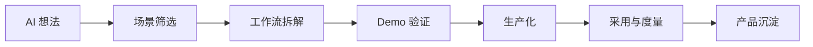

# 为什么 AI 时代需要 FDE？

一个企业做“AI 周报助手”，Demo 很快。

模型能读取项目文档，生成本周进展、风险和下周计划。老板看完觉得很好：这不就是每周例会前最烦的那件事吗？

但试点一周后，团队发现大家还是在手动改。

不是因为模型不会写，而是因为不同部门对“风险”“延期”“完成”的口径不一样。有些风险不能直接写进周报，有些进展需要先和业务负责人确认，有些数字来自临时表格，系统根本拿不到。

这就是 AI 时代最典型的落地断点。

模型能生成内容，但组织没有准备好接住它。

> **AI 的上限由模型决定，AI 在企业里的下限由部署方式决定。FDE 解决的正是这个下限问题。**

## 一句话定义

AI 让企业重新相信一件事：软件不只是记录流程，还可以参与流程。

过去，一个系统主要负责记录、流转和查询；现在，AI 似乎可以阅读文档、理解语义、生成内容、调用工具、辅助判断，甚至参与一部分业务流程。于是很多团队自然会问：既然模型已经这么强，企业是不是很快就能完成智能化升级？

现实没有这么顺。模型能力往前冲得很快，但组织吸收技术的速度没有同步变快。很多公司不是不会买模型，也不是不会做 Demo，而是不知道怎么把 AI 放进真实的权限、数据、流程和责任里。

企业 AI 落地的难点，越来越少是“能不能调用模型”，越来越多是“模型能力如何进入真实组织”。这中间隔着数据、权限、流程、评测、风险、用户采纳和生产责任。也正是在这里，FDE 的价值变得更明显。

在 AI 项目语境下，FDE 可以被理解为“AI 能力生产化的现场工程角色”。它的对象不是单个模型接口，而是模型、数据、业务流程、工具调用、权限体系、人工复核和运行指标组成的一整套系统。它要解决的问题，也不是让 AI 回答一次，而是让 AI 在可控边界内持续参与工作。

这一定义很重要。因为企业 AI 项目只要进入真实流程，就会从模型应用变成系统工程：输入是否可信，输出是否可评测，动作是否可追责，异常是否可回滚，业务是否愿意接管。FDE 正是把这些问题放到同一张工程图里处理的人。

## AI 的能力上限变高了，落地复杂度也变高了

生成式 AI 降低了做 Demo 的门槛。

一个团队可以很快做出知识库问答、客服助手、销售线索总结、会议纪要、代码生成、自动报告。演示时效果不错，甚至会让人觉得“这不就已经能用了？”

但企业真正需要的不是一次回答正确，而是稳定进入业务流程。

比如一个“客服 AI 助手”，如果只是根据知识库回答问题，它只是一个工具。如果它要成为生产系统，就必须回答更多问题：

- 它能读取哪些知识？谁有权维护这些知识？
- 客户问题涉及隐私或合同时，模型应该如何处理？
- 答案错误时，谁负责确认和纠正？
- 它如何接入工单系统、客服工作台和质检流程？
- 如何评估它真的缩短了响应时间，而不是制造新的返工？
- 当知识库变化、模型版本变化、业务规则变化时，系统如何回归测试？

这时，AI 项目就不再只是模型应用，而变成了现场工程。

FDE 正适合处理这种复杂度：它不只是把模型接上去，而是把 AI 能力嵌入组织已有的工作系统里。

| 阶段 | Demo 里常被忽略的问题 | 生产系统必须回答的问题 |
| --- | --- | --- |
| 数据 | 样例数据能跑就行 | 数据来源、权限、更新、脱敏是否可持续 |
| 输出 | 看起来像对的 | 是否可评测、可追责、可回放 |
| 流程 | 单次演示跑通 | 是否嵌入真实岗位和系统动作 |
| 风险 | 暂时人工兜底 | 错误、泄露、越权、误操作如何处理 |
| 运营 | 演示结束即可 | 谁维护、谁接管、如何迭代 |

## 企业 AI 的核心瓶颈在“工作流”

很多企业 AI 项目一开始会从工具出发：我们要做一个助手、一个 Agent、一个知识库、一个自动报告。

但真正值得追问的是：它要改变哪条工作流？

AI 如果没有进入工作流，通常只能带来局部效率；只有进入工作流，才可能改变组织效率。这里的工作流不是简单的流程图，而是一组真实发生的活动：信息从哪里来，谁处理，谁判断，谁批准，结果输出到哪里，后续如何反馈。

FDE 在 AI 项目中的第一项工作，往往不是写代码，而是重新识别工作流：

- 哪些步骤是重复劳动？
- 哪些步骤依赖经验判断？
- 哪些输入可以稳定获得？
- 哪些判断必须保留人工确认？
- 哪些输出能直接影响业务结果？
- 哪些风险一旦出错不可接受？

这也是为什么“AI 工作流”会成为 FDE 的核心场景。AI 不是被孤立地放在一个聊天框里，而是被部署到信息收集、内容生成、判断辅助、任务分发、复盘反馈等环节中。

稍微说得直白一点：企业不是缺一个会聊天的 AI，而是缺一套能接住 AI 的工作系统。

> **AI 项目的分水岭，不是有没有模型，而是有没有一条被重新设计过的工作流。**

## FDE 如何把 AI 从想法推进到生产

AI 时代的 FDE，通常会围绕五件事展开。

第一，识别高价值场景。不是所有场景都适合 AI，也不是所有 AI 场景都值得做。FDE 需要判断频率、价值、数据可得性、错误成本、用户采纳和可扩展性。

第二，建立现场事实。AI 项目最怕在会议室里想象流程。FDE 要进入真实业务环境，看一线人员实际怎么工作，数据实际在哪里流动，异常实际怎么处理。

第三，构建最小可验证系统。Demo 的意义不是炫技，而是验证关键假设：数据是否够用，输出是否可信，用户是否愿意使用，流程是否能接起来。

第四，推进生产化。生产系统需要权限、审计、日志、监控、成本控制、失败兜底、评测回归和人工复核机制。AI 越接近业务关键流程，这些机制越重要。

第五，沉淀可复用模式。一个客户现场发现的问题，可能代表一类行业需求；一个项目里的评测方法、权限模式、工具调用方式，也可能成为平台能力的一部分。FDE 要把现场经验带回产品和工程体系。

这条路径可以简化成：

---

## 实战拆解：AI 周报助手为什么卡住

回到开头那个 AI 周报助手。

如果团队只从模型能力出发，会很容易得出一个结论：Prompt 还要优化，知识库还要补充，生成格式还要稳定。

这些当然要做。

但它们不是最核心的问题。

真正的卡点在工作流里：

| 表面问题 | 真实问题 |
| --- | --- |
| 周报写得不准 | 数据来源不统一，部分进展只在群聊里 |
| 风险描述不合适 | 风险公开范围和责任归属没有规则 |
| 用户频繁修改 | AI 不知道哪些内容需要先确认 |
| 部门不愿意直接采用 | 周报输出会影响考核和跨部门协作 |

这时 FDE 要做的，不是继续把助手做得更会写。

而是重新设计 AI 应该进入哪一段流程：先做信息汇总？先做风险草稿？先给项目负责人确认？还是先做内部复盘，不直接发给管理层？

AI 项目的难点，常常不在模型会不会生成，而在生成之后谁确认、谁负责、谁接管。

这就是为什么 AI 时代更需要 FDE。

FDE 不是站在模型旁边做包装，而是站在组织流程里设计部署方式。

## 为什么现在大家重新谈 FDE？

FDE 并不是生成式 AI 发明之后才出现的。Palantir 很早就把 Forward Deployed Engineering 作为一种贴近客户现场、持续发展产品能力的实践。只是在 AI 时代，这种模式被推到了更中心的位置。

原因很简单：AI 的能力越强，越需要被正确部署。

传统软件如果配置错了，可能只是流程不顺；AI 系统如果设计不好，可能会生成错误建议、泄露敏感信息、误导业务判断，或者在没有责任边界的情况下自动执行操作。AI 让系统更有能力，也让系统更需要治理。

OpenAI 成立 Deployment Company，强调工程师嵌入复杂组织，识别高影响场景，重构关键工作流；Accenture 与 Microsoft 推出 FDE practice，目标也是帮助企业把 AI 从想法推进到生产结果。这些信号说明，FDE 不再只是少数公司的组织语言，而正在变成企业 AI 规模化落地的一种重要模式。

## 不是所有 AI 项目都需要 FDE

如果只是个人用 AI 写邮件、整理资料，或者团队内部做一个低风险工具，不一定需要 FDE。

但当 AI 项目出现下面这些特征时，就很可能需要 FDE 式的推进方式：

- 它要改造一条真实业务流程，而不是做一个孤立工具。
- 它需要接入企业数据、权限、系统和审计机制。
- 它涉及多个团队的协作和责任划分。
- 它的输出会影响客户体验、业务决策或风险控制。
- 它不能停在 Demo，必须稳定进入生产环境。
- 它需要评测、监控、反馈和持续迭代。
- 它的经验未来可以沉淀成产品或平台能力。

AI 时代需要 FDE，不是因为 FDE 这个词更高级，而是因为企业 AI 落地正在从“模型能力展示”进入“生产系统建设”。这是一个小小的岗位变化，也是一个更大的产业信号：AI 的竞争，正在从谁的模型更强，走向谁能让模型真的进入组织。

在这个阶段，真正稀缺的不是会调用模型的人，而是能把模型、数据、工具、权限、流程和业务结果连成闭环的人。

可以用这张小表做最后判断：

| 如果你的 AI 项目是... | 更适合的推进方式 |
| --- | --- |
| 个人提效、低风险、无需系统接入 | 工具培训或轻量自动化 |
| 单一部门试点，有明确需求和数据 | AI 应用开发 + 项目交付 |
| 跨系统、跨权限、跨流程，且必须进生产 | FDE 式现场部署 |
| 多个客户反复出现同类场景 | FDE + 产品平台化 |
