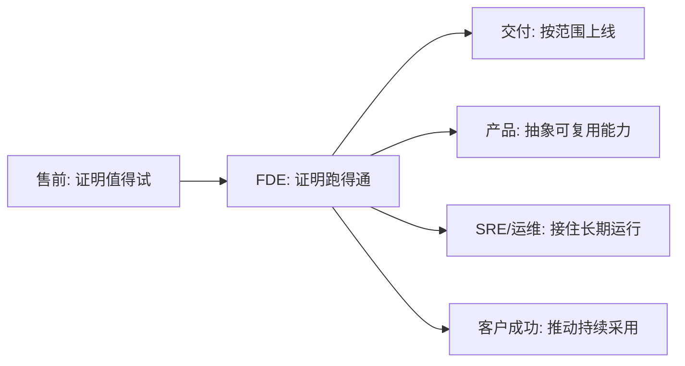

# FDE 和产品经理、售前、咨询、交付工程师有什么区别？

FDE 火起来之后，最常见的误会是两句：这不就是高级咨询吗？这不就是驻场外包吗？

这个误会很正常。FDE 确实和很多角色都有交集。它要理解客户现场，所以看起来像咨询或客户成功；它要解释技术方案，所以看起来像售前或解决方案架构师；它要动手构建系统，所以看起来像工程师；它要判断优先级和产品沉淀，所以又和产品经理很近。

但 FDE 不是这些角色的简单相加。它真正的位置，是在产品、工程、客户现场和业务结果之间，承担高不确定性阶段的整合责任。

如果一句话概括：相邻角色通常各自负责一段边界，FDE 负责把这些边界在现场重新接起来。

更专业地说，FDE 的角色边界不是由“做哪些任务”定义的，而是由“承担哪类不确定性”定义的。产品经理主要承担产品抽象和路线选择，售前主要承担方案价值证明，咨询主要承担业务诊断和管理建议，交付工程师主要承担既定范围内的上线执行。FDE 则主要承担从模糊现场到可运行系统之间的转化责任。

所以判断一个角色是不是 FDE，不能只看他是否会写代码、是否见客户、是否做方案，而要看他是否同时参与了问题重定义、工程验证、生产落地和产品反哺。

> **一句可以带走的判断：FDE 的价值不在“比别人多做几件事”，而在“把别人交接不清的地方做成闭环”。**

## 为什么角色边界会变得模糊？

在标准化软件交付中，角色边界相对清楚。

售前负责证明方案有价值，产品负责定义能力，工程负责实现系统，实施负责上线交付，客户成功负责采用和续约。每个角色都有自己的责任段。

但 FDE 面对的场景往往不是标准化的。

客户的问题可能还没有被定义清楚，业务流程可能只存在于一线人员的经验里，数据可能分散在多个系统中，产品能力可能只覆盖了一部分，AI 能力看起来可用但还没有生产验证。这个时候，如果每个角色只守住自己的边界，项目就会卡在边界之间。

FDE 正是在这种边界摩擦中出现的。

它不是替代其他角色，而是在问题尚未稳定、反馈特别密集、责任难以切分的阶段，把现场事实、技术实现、产品判断和业务价值先接成一个闭环。

## 用一个 AI 项目看差异

假设一家大型企业希望建设“AI 客户支持助手”，目标是缩短客服响应时间，提升答案一致性，并把高频问题反哺到知识库和产品改进中。

不同角色看到的是不同层面。

产品经理会问：这个能力服务哪类用户？产品边界在哪里？哪些需求可以标准化？未来是否能进入产品路线图？

售前工程师会问：如何向客户证明这个方案有价值？演示什么场景最有说服力？哪些能力能推动客户进入试点或采购？

咨询顾问会问：客户当前客服流程的瓶颈在哪里？组织分工和知识管理机制是否合理？需要怎样的流程重构和变革节奏？

解决方案架构师会问：系统如何接入工单、知识库、CRM、身份权限和审计？检索、模型、工具调用和人工审核如何组合？

交付工程师会问：范围是什么？配置怎么做？数据怎么迁移？上线计划和验收标准是什么？

SRE 或运维团队会问：系统上线后如何监控？延迟、成本、可用性、告警、回滚和故障响应怎么设计？

FDE 会把这些问题放在同一条现场链路里看：客户支持到底卡在哪个环节？AI 应该进入接单、检索、回答、质检还是复盘？哪些数据可用，哪些权限不可碰？什么 Demo 能验证关键假设？上线后如何证明响应时间、一次解决率或返工率真的改善？这个项目里的哪些模式能沉淀为产品能力？

这就是 FDE 的特殊位置。它不一定拥有每个问题的最终所有权，但它负责让这些问题在现场形成工程闭环。

## 一张表看角色差异

| 角色 | 主要关注 | 成功信号 | 与 FDE 的关系 |
| --- | --- | --- | --- |
| 产品经理 | 产品边界、用户价值、路线图 | 能力可复用，方向可规模化 | FDE 提供现场验证和产品学习 |
| 售前工程师 | 价值展示、可行性说明、商业推进 | 客户理解价值并进入下一步 | FDE 接住高不确定性的落地验证 |
| 咨询顾问 | 业务诊断、流程设计、组织共识 | 客户形成清晰路径和变革方案 | FDE 把判断推进到系统和数据中 |
| 解决方案架构师 | 目标架构、集成路径、技术选型 | 架构可落地，风险可解释 | FDE 用现场反馈校准架构假设 |
| 交付工程师 | 实施、配置、迁移、上线 | 项目按范围交付 | FDE 先降低不确定性，再交接可实施范围 |
| SRE / 运维 | 可用性、监控、容量、故障响应 | 系统稳定运行，SLO 达标 | FDE 把现场运行要求转成生产约束 |
| 客户成功 | 采用、满意度、续约、扩展 | 客户持续使用并认可价值 | FDE 提供可证明的工程价值证据 |
| FDE | 现场发现、工程验证、生产采用、产品反哺 | 问题被做成系统，并产生可度量结果 | 位于现场、工程、产品和业务结果之间 |

## FDE 和产品经理：一个负责产品抽象，一个负责现场验证

产品经理关注的是产品如何服务更广泛的用户，如何形成清晰边界和长期路线。FDE 关注的是某个复杂现场里，问题如何被验证、实现和落地。

两者最好的关系不是互相替代，而是互相校准。

产品经理需要 FDE 带回真实现场的证据：客户真正怎么工作，产品能力哪里不够，哪些需求只是个别定制，哪些需求代表可复用模式。

FDE 也需要产品经理帮助判断：哪些现场能力值得沉淀，哪些不应该进入产品，哪些客户需求会把产品拖向不可维护的方向。

如果没有产品判断，FDE 容易陷入无止境定制；如果没有 FDE 的现场反馈，产品容易停留在抽象想象。

## FDE 和售前、咨询：一个证明可能，一个证明可运行

售前通常负责让客户相信方案值得尝试，咨询通常负责帮助客户形成问题诊断和行动路径。这两类角色都很重要，但它们不一定承担系统能否在现场跑起来的责任。

FDE 要面对更硬的验证。

客户说“我们想用 AI 提升客服效率”，售前可以展示方案，咨询可以设计流程，FDE 则要进入现场判断：哪些知识能被检索，哪些问题需要人工确认，哪些输出能直接进入工单，哪些错误会带来合规风险，什么指标能证明效率提升。

换句话说，售前和咨询更多是在建立“应该做什么”和“为什么值得做”的共识；FDE 要进一步证明“怎样做才能真的运行”。

## FDE 和交付工程师：一个处理不确定性，一个执行确定范围

交付工程师通常在范围比较明确之后工作：按照方案实施、配置、迁移、上线和验收。

FDE 更常出现在范围尚未稳定的阶段。它要通过现场发现、原型验证和小范围试点，把不确定性降下来，再把可实施的部分交给交付、平台、SRE 或客户团队接住。

所以 FDE 不应该长期代替交付团队。一个好的 FDE 项目，最后应该能留下清晰的交接产物：

- 已验证的业务目标。
- 系统架构和集成方式。
- 数据、权限和审计要求。
- 运行指标、告警和回滚方案。
- 用户采用情况和业务价值证据。
- 可以反哺产品或平台的能力清单。

FDE 的价值不是一直留在现场，而是把现场从混沌推进到可运行、可交接、可复用。

## FDE 的边界感

FDE 不是万能救火队。越成熟的 FDE，越需要边界感。

它不能为了短期满意度绕过安全和审计；不能把客户所有流程问题都用一次性脚本兜住；不能把没有普遍性的定制包装成平台能力；也不能在没有运行责任人的情况下交付生产自动化。

FDE 的核心边界可以概括为三句话：

- 对“从问题到生产可用”的工程闭环负责。
- 对“现场事实进入产品学习”的反馈闭环负责。
- 对“价值是否可证明”的业务闭环负责。

但它不替代销售、产品、平台、SRE、交付和客户成功。它真正重要的地方，是在边界最模糊的时候，把关键问题先接起来，让后续角色能够接得住。

这就是 FDE 和相邻角色最大的区别：它不是多做几件事，而是在复杂现场里承担从不确定性到可运行能力的转化责任。

如果说咨询交付认知，外包交付产能，产品交付通用能力，那么 FDE 交付的是转化：把现场里说不清的问题，变成系统里跑得起来的能力，再把其中有复用价值的部分带回产品。

## 结尾判断框架

下次你判断一个角色是不是 FDE，不妨问三个问题：

| 问题 | 如果答案是“否” | 更像什么 |
| --- | --- | --- |
| 他是否进入现场重新定义问题？ | 否，只是讲方案 | 更像售前或咨询 |
| 他是否承担从假设到系统的工程验证？ | 否，只做建议或协调 | 更像咨询或客户成功 |
| 他是否把现场经验反哺产品或平台？ | 否，做完即交付 | 更像项目交付或外包 |

三个答案都是“是”，才更接近 FDE。

> **没有现场发现，FDE 会退化成售前；没有工程验证，FDE 会退化成咨询；没有产品反哺，FDE 会退化成外包。**
