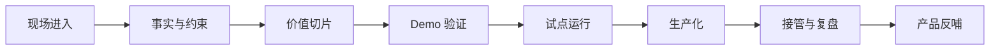

# 一个 FDE 项目从 0 到 1 怎么发生？

某家连锁零售企业的运营负责人第一次找来时，诉求很清楚：

“我们想做一个 AI 助手，帮门店店长自动分析销售下滑原因。”

这句话听起来很像一个标准 AI 项目。

有业务痛点，有数据，有明确用户，还有一个看起来很自然的产品形态：AI 助手。

但 FDE 真正进入项目时，第一件事不是写 Prompt，也不是选模型。

是先问一句：

“销售下滑这件事，现在到底是怎么被发现、解释和处理的？”

这个问题一问，项目就变了。

两天访谈下来，团队发现门店店长并不是不会分析销售下滑。他们真正卡住的是：总部活动、门店库存、天气、竞品促销、人员排班和会员触达分散在不同系统里。每次销售下滑，店长只能靠经验猜原因，再在群里问区域经理。

所以，真实问题不是“缺一个 AI 助手”。

真实问题是：销售异常发生后，组织没有一套稳定的归因和动作闭环。

这就是一个 FDE 项目从 0 到 1 的起点。

> **FDE 项目不是从需求开始，而是从现场失真开始。**

## 第一步，不急着做方案

很多项目一开始就会急着进入方案讨论。

做助手还是做工作台？用 RAG 还是 Agent？先接哪个系统？Demo 什么时候能出来？

这些问题都重要。

但它们不是第一问题。

FDE 进入现场时，最先要确认的是：眼前这个“需求”，是不是已经准确描述了真实问题。

在零售案例里，如果团队直接接受“AI 助手”这个说法，很快就能做一个看起来不错的 Demo：店长输入“为什么本周销售下滑”，系统输出几个可能原因。

问题是，这个 Demo 很可能只是在复述常识。

它没有接住库存断货，没有接住活动覆盖，没有接住竞品影响，也没有接住后续动作。

所以第一步不是做方案。

是进入真实流程。

| 要看什么 | 具体问题 |
| --- | --- |
| 谁在承受问题 | 店长、区域经理、运营、商品、会员团队分别痛在哪里 |
| 问题在哪里发生 | 是发现慢、归因慢、决策慢，还是执行慢 |
| 现在怎么兜底 | 靠群聊、表格、人工经验，还是靠临时会议 |

FDE 的第一项工作，就是把会议里的说法，拉回现场里的动作。

## 第二步，把愿望和事实分开

客户说“我们希望 AI 自动分析原因”，这是一种愿望。

愿望不等于事实。

FDE 要把它拆成三类东西：

| 类型 | 零售案例里的例子 |
| --- | --- |
| 事实 | 哪些门店下滑、持续几天、哪些品类下滑、库存是否异常 |
| 约束 | 数据分散在 POS、库存、活动、会员、排班系统里 |
| 目标 | 缩短归因时间，提升行动准确率，而不是单纯生成分析文字 |

这一步很关键。

如果事实、约束和目标混在一起，项目很容易变成“做一个看起来聪明的界面”。Demo 会漂亮，但生产会尴尬。

> **FDE 最怕的不是客户没有需求，而是把愿望当成事实。**

## 第三步，切出第一个价值闭环

FDE 不会一上来重构整个零售运营体系。

那太大，也太慢。

好的第一步，是切出一个很小但完整的价值闭环。

比如：

“当某门店连续三天某品类销售低于过去四周均值时，系统自动拉取库存、活动、天气、会员触达和排班信息，生成异常归因建议，并给出三类可执行动作：补货、调陈列、触达会员。店长确认后记录处理结果。”

这就比“做一个 AI 销售分析助手”更像 FDE 项目。

因为它包含了完整闭环：

- 触发条件：连续三天下滑。
- 用户角色：门店店长。
- 输入数据：库存、活动、天气、会员、排班。
- 关键判断：下滑可能由什么造成。
- 输出结果：建议动作。
- 人工边界：店长确认。
- 反馈回路：记录处理结果。

FDE 切的不是功能点。

切的是价值闭环。

## 第四步，做 Demo，但别把 Demo 当胜利

Demo 很重要。

它让客户第一次看到“东西在动”。

但 Demo 的意义不是证明团队很会做，而是验证几个关键假设：

- 数据能不能拿到？
- 归因逻辑是否说得通？
- 店长愿不愿意用？
- 建议动作是否真的可执行？
- 人工确认流程是否顺畅？

在零售案例里，第一版 Demo 只接了 10 家门店、3 个品类和 2 周历史数据。

它很粗糙。

但它验证了一件关键事情：店长并不需要一个能聊天的助手，他们需要的是“异常原因 + 下一步动作 + 为什么这么判断”。

这比做一个完整界面更重要。

Demo 阶段必须留下这些记录：

| 记录 | 为什么重要 |
| --- | --- |
| 演示链路 | 说明当前 Demo 到底验证了什么 |
| 失败样本 | 看系统在哪些场景判断错 |
| 临时绕开的约束 | 防止 Demo 冒充生产能力 |
| 继续或停止判断 | 决定是否进入试点 |
| 下一阶段风险 | 把风险带进工程计划 |

Demo 不是舞台表演。

Demo 是风险探针。

## 第五步，让真实用户进入试点

试点不是扩大演示。

试点是让系统第一次撞上真实组织。

在零售案例里，试点选择了 20 家门店。系统不自动决策，只给店长建议。店长可以采纳、修改或忽略。每一次修改都被记录下来。

这时团队开始看到真实问题：

- 有些下滑不是经营问题，而是活动周期变化。
- 有些门店库存数据延迟一天，导致建议不准。
- 有些店长不相信“会员触达不足”这个判断，因为他们看不到证据。
- 区域经理更关心跨门店对比，而不是单店解释。

这些问题在 Demo 里不会出现。

只有真实用户进入，系统才会暴露真实边界。

试点阶段要看的，不只是“AI 输出好不好”。

| 试点观察项 | 不要只看 |
| --- | --- |
| 用户是否进入流程 | 不要只看口头认可 |
| 人工修改率是多少 | 不要只看输出是否流畅 |
| 异常如何处理 | 不要只看正常样本 |
| 业务指标是否变化 | 不要只看演示反馈 |
| 谁能接管运行 | 不要只看 FDE 能不能维护 |

## 第六步，生产化其实是在重新设计责任

从试点到生产，不是“把代码加固一下”。

生产化意味着系统开始被组织依赖。

这时问题会变得更现实：

- 数据延迟谁负责？
- 建议错了谁处理？
- 店长不用怎么办？
- 区域经理如何复查？
- 系统出问题怎么回滚？
- 新活动上线后规则谁更新？

这些都不是单纯技术问题。

它们是责任设计问题。

所以生产化阶段要补齐账号、权限、日志、告警、回滚、成本、延迟、评测、培训和接管。

可以把 FDE 项目的生命周期理解成：

真正进入生产的标志，不是系统上线。

是责任被接住。

## 第七步，把一次项目变成下一次能力

FDE 项目结束时，最重要的不是写一份项目总结。

而是回答一个问题：

这次现场学习，有没有变成下一次更快、更稳的能力？

在零售案例里，最后沉淀下来的不只是一个销售异常分析系统，还包括：

- 一套门店异常归因模板。
- 一份数据接入和质量检查清单。
- 一个店长采纳率评测集。
- 一套区域经理复查视图。
- 一份客户运营团队接管手册。

这些东西，才是 FDE 的复利。

如果一个客户的问题只被一次性解决，没有任何经验进入产品、平台、模板或方法论，那它更像项目交付。

FDE 要多走一步。

把个案变成模式。

## 怎么判断项目真的从 0 到 1

可以看三条线：

| 判断线 | 如果没有 | 说明 |
| --- | --- | --- |
| 从现场到问题 | 只是在接需求 | 没有完成发现 |
| 从问题到系统 | 只是在写方案 | 没有完成工程验证 |
| 从系统到复用 | 只是在做项目 | 没有完成产品反哺 |

三个闭环都走通，FDE 项目才真正发生。

回到开头那个“AI 助手”的需求。

如果最后只是做了一个聊天窗口，它可能是一个 AI 项目，但不一定是一个好的 FDE 项目。

如果它让门店异常被发现、被解释、被处理、被复盘，并最终沉淀成一套可复制的运营能力，这才是 FDE 的 0 到 1。

> **FDE 不是把一个明确需求交付完，而是把一个模糊现场推进到组织可以依赖的能力。**
