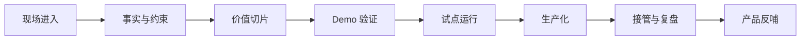

# 一个 FDE 项目从 0 到 1 怎么发生？

一个 FDE 项目通常不是从“需求文档”开始的，而是从一场说不清楚的会议开始。

业务方说：“我们需要一个智能助手。”

技术方说：“先把需求写清楚。”

管理层说：“希望尽快看到效果。”

每句话都对，但每句话都不够。客户觉得某个业务环节很低效，团队也知道 AI、数据平台或自动化可能有帮助，但没人能准确说清楚问题边界。

FDE 的工作，就是把这种模糊状态推进成可验证、可运行、可交接的系统能力。

从项目管理角度看，FDE 项目不是传统意义上的需求交付项目，而是一类“现场探索型工程项目”。它的起点通常不是稳定 PRD，而是一个尚未被准确定义的业务问题；它的过程不是线性执行，而是现场调研、问题切片、原型验证、试点运行和生产化改造的连续循环；它的终点也不只是上线，而是业务结果被验证、运行责任被接住、经验被产品或平台吸收。

因此，FDE 项目的 0 到 1，核心不是从无到有写出功能，而是从混沌到清晰建立一条可信路径。

> **一句可以带走的判断：FDE 项目不是从需求开始，而是从现场失真开始。**

## 第一阶段：进入现场，不急着做方案

FDE 进入项目时，最重要的不是马上画架构图，而是确认现场到底发生了什么。

这里的“现场”不一定是物理驻场，也可以是进入客户的真实工作环境：例会、系统、工单、表格、审批流、客服记录、销售跟进、运营看板、异常处理群。FDE 要先看见真实流程，而不是只听见会议里的流程。

这一阶段要回答三个问题：

| 问题 | 为什么重要 |
| --- | --- |
| 谁真的在承受这个问题？ | 避免只服务声音最大的人 |
| 问题发生在哪个具体环节？ | 避免把整个组织问题包装成一个功能需求 |
| 现在靠什么方式兜底？ | 人工兜底往往藏着真正的业务规则 |

比如客户说“客服效率低”，现场可能拆出完全不同的问题：知识库不更新、工单分类混乱、权限查不到、质检规则不一致、复杂问题没人接手。不同问题对应的技术方案完全不同。

## 第二阶段：把事实、约束和目标分开

FDE 最怕把愿望当事实。

客户说“我们每天有大量重复咨询”，这是愿望式描述；真正的事实应该是：每天多少工单，重复问题占比多少，哪些问题能被知识库覆盖，哪些必须人工判断，平均处理时长是多少，错误回复造成什么后果。

一个 FDE 项目早期至少要整理三类信息：

| 类型 | 示例 |
| --- | --- |
| 事实 | 系统日志、历史数据、人工处理记录、真实用户反馈 |
| 约束 | 数据权限、合规边界、系统接口、组织责任、预算和周期 |
| 目标 | 要缩短时间、降低成本、提高准确率，还是增强可追溯性 |

这一步很像把雾擦掉。只有事实、约束和目标分开，后面才不会出现“Demo 很漂亮，但根本不能上线”的尴尬。

## 第三阶段：找到第一个价值切片

FDE 不会一上来重构整个流程。

好的第一步通常是一个很小但完整的价值闭环。它不一定覆盖最大范围，但必须能证明一件事：这个方向值得继续投入。

一个好的切片通常包含：

- 明确用户：谁会用？
- 触发场景：什么时候发生？
- 输入数据：从哪里来？
- 关键判断：系统要帮人做什么判断？
- 输出结果：用户拿到什么？
- 验收条件：怎样算有效？
- 运行边界：哪些暂时不做？

> **FDE 切的不是功能点，而是价值闭环。**

比如“接入知识库检索”不是完整切片；“客服在处理退款咨询时，能在 30 秒内看到相关政策、历史案例和建议回复，并保留人工确认”才更接近可验证切片。

## 第四阶段：做 Demo，但 Demo 是用来验证假设的

FDE 项目里的 Demo 不是舞台表演，也不是小型产品。

Demo 的作用是验证关键假设：数据能不能用，接口能不能接，用户是否愿意改变动作，AI 输出是否可信，人工确认是否顺畅。

这一阶段最容易犯的错，是为了让 Demo 好看而绕开真实约束。比如用手工整理好的数据、用临时账号、用离线脚本、用只有演示人知道的操作步骤。这样 Demo 当然能跑，但它没有降低生产风险。

Demo 阶段应该留下这些产物：

- 演示链路。
- 失败样本。
- 暂时绕开的真实约束。
- 继续、缩小或停止的判断。
- 下一阶段需要验证的风险。

## 第五阶段：试点，让真实用户进入

Demo 验证的是“方向可能成立”，试点验证的是“真实流程能不能跑”。

试点阶段要引入真实用户、受控数据、有限权限和基础监控。它不一定要覆盖全量业务，但必须接触真实工作节奏。

这一阶段要关注的不只是系统输出好不好，还要看用户是否真的愿意用：

| 试点观察项 | 要看的不是 |
| --- | --- |
| 用户是否进入流程 | 不是只看用户口头认可 |
| 人工修改率是多少 | 不是只看 AI 输出是否流畅 |
| 异常如何处理 | 不是只看正常样本 |
| 业务指标是否变化 | 不是只看演示反馈 |
| 谁能接管运行 | 不是只看 FDE 能不能维护 |

试点的意义，是让项目第一次和真实组织发生碰撞。

## 第六阶段：生产化，重新设计责任

从试点到生产，不是“把代码加固一下”。

生产化意味着系统开始被组织依赖，责任也必须被重新设计。账号、权限、日志、告警、回滚、成本、延迟、评测、培训、接管，都要从临时状态变成可运营状态。

可以把 FDE 项目的生命周期理解成：

## 第七阶段：复盘和产品反哺

FDE 项目结束时，最重要的不是写一份“项目总结”，而是回答：这次现场学习有没有变成下一次更快、更稳的能力？

如果一个客户的问题只被一次性解决，没有任何经验进入产品、平台、模板或方法论，那它更像项目交付。FDE 的复利来自反哺。

复盘时至少要留下：

- 哪类场景被验证了？
- 哪些数据、权限、流程模式可以复用？
- 哪些产品能力缺口被发现？
- 哪些技术债不能继续带到下一个客户？
- 哪些模板、组件、评测集或运行手册可以沉淀？

## 结尾判断框架

判断一个 FDE 项目有没有真正从 0 到 1，可以看三条线：

| 判断线 | 如果没有 | 说明 |
| --- | --- | --- |
| 从现场到问题 | 只是在接需求 | 没有完成发现 |
| 从问题到系统 | 只是在写方案 | 没有完成工程验证 |
| 从系统到复用 | 只是在做项目 | 没有完成产品反哺 |

三个闭环都走通，FDE 项目才真正发生。

这也是 FDE 项目和普通项目最大的差别：它不是把一个明确需求交付完，而是把一个模糊现场推进到组织可以依赖的能力。中间每一步都不神秘，但每一步都需要判断。
