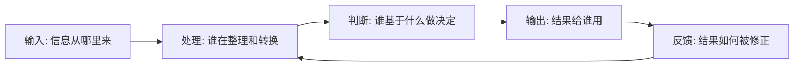

# FDE 如何发现真实问题？

客户说“我们想做一个 AI 助手”，你千万别太快开始做助手。

这句话背后可能是知识库没人维护，可能是审批链太长，可能是数据口径混乱，也可能是管理层只是想看到一个“AI 项目”。客户说出口的需求，往往不是现场真正的问题。

这不是说客户不懂业务。恰恰相反，客户最懂自己的现场，但真实问题常常被包在日常语言里：太慢、太乱、太依赖人、数据不准、系统不好用、想用 AI 提效。FDE 的第一项硬功夫，就是把这些模糊表达还原成事实、约束、流程和价值损失。

在 FDE 方法里，“真实问题”不是客户最先说出的需求，也不是团队最容易想到的功能，而是一个可以被事实证明、可以被工程介入、可以产生业务结果的问题定义。它通常包含四个部分：发生场景、受影响角色、现有约束和可衡量损失。

比如“想做 AI 助手”不是严格的问题定义；“客服在处理退款咨询时，平均要切换 3 个系统查询政策和历史订单，导致响应时间超过 8 分钟，并且不同客服口径不一致”才更接近 FDE 可以处理的真实问题。

> **一句可以带走的判断：客户给你的通常是症状，不是诊断；FDE 的工作是先诊断，再开方。**

## 一句话定义

FDE 发现真实问题，就是把客户口头表达的需求，拆回到具体场景、受影响角色、事实证据、系统约束和业务损失里。

它不是为了否定客户的说法。

而是为了防止团队过早把一个“症状”做成一个功能。

## 表层需求和真实问题不是一回事

一个典型场景是：客户说“我们想做一个 AI 助手”。

表面看，这是一个产品形态需求。但往下拆，可能有完全不同的真实问题：

| 客户说法 | 可能的真实问题 |
| --- | --- |
| 想做 AI 助手 | 知识分散，员工找不到信息 |
| 想自动生成日报 | 数据口径不统一，人工汇总耗时 |
| 想做智能客服 | 问题分类混乱，知识库无人维护 |
| 想让销售自动跟进 | 线索优先级不清，跟进动作不可追踪 |
| 想做管理驾驶舱 | 决策指标没有统一定义 |

如果 FDE 直接按表层需求做，很容易做出一个“看起来对，但用不起来”的系统。

## 真实问题藏在哪里？

真实问题通常不会整齐地写在 PRD 里，它会分散在五个地方。

第一，流程断点。事情从一个角色流到另一个角色时，最容易出问题。比如客服转工单、销售交接客户、运营上报异常、财务审核付款。

第二，数据断点。数据存在，但不可用；字段有，但口径不一致；系统里有记录，但关键判断仍靠人工经验。

第三，系统断点。多个系统各管一段，没有统一入口，也没有清晰的状态流转。

第四，组织断点。没人真正拥有这个流程，或者每个部门只优化自己的局部指标。

第五，指标断点。大家都说要提效，但没有定义到底是缩短时间、降低错误、提升转化，还是减少风险暴露。

FDE 发现问题，就是把这些断点一一摊开。

---

## 实战拆解：客服为什么总说“知识库不好用”

一个客服团队说，他们想做一个 AI 知识库助手。

理由听起来很充分：新人找不到答案，老人回答口径不一致，主管每天都在群里补充政策解释。

如果只听这一层，项目很容易变成 RAG 问答。

但现场观察后，团队发现客服不是“找不到知识”，而是“找到了也不敢用”。因为退款政策经常和订单状态、用户等级、渠道规则绑定，知识库里写的是通用条款，真实判断要查订单系统和历史案例。

这时问题就被重写了：

不是“知识库不好用”，而是“客服缺少一个能把政策、订单和历史处理结果放在一起判断的工作入口”。

这才是 FDE 要找的真实问题。

## 不要只访谈，要看证据

访谈很重要，但只靠访谈不够。

业务负责人会讲目标，一线员工会讲痛点，技术团队会讲系统限制，管理层会讲战略诉求。每个人都说的是事实的一部分，但都不是全貌。

FDE 需要把访谈和证据放在一起看：

| 信息来源 | 能看到什么 | 容易漏掉什么 |
| --- | --- | --- |
| 负责人访谈 | 目标、优先级、组织压力 | 真实操作细节 |
| 一线观察 | 实际流程、人工兜底、隐性规则 | 长期战略意图 |
| 系统日志 | 频率、时长、异常、失败点 | 为什么这样操作 |
| 历史工单 | 重复问题、返工原因、责任边界 | 未被记录的人工沟通 |
| 表格/群聊 | 临时流程和真实协作 | 正式系统中的约束 |

> **FDE 不只是听客户怎么说，而是看组织实际上怎么运行。**

## 用五步拆出真实问题

FDE 可以用一个简单的拆解框架：输入、处理、判断、输出、反馈。

这套框架的好处是，它能把一个抽象问题变成可观察的工作流。

比如“日报生成太慢”，可以拆成：

- 输入：数据来自哪些系统？是否需要人工复制？
- 处理：谁在清洗、合并、解释数据？
- 判断：哪些内容是事实，哪些是主观判断？
- 输出：日报给谁看？用于什么决策？
- 反馈：日报错了谁修？下次是否会变好？

拆到这一步，问题往往会变得很具体：也许不是缺一个日报工具，而是缺统一指标口径；也许不是写作慢，而是数据源不可信；也许不是 AI 生成能力不够，而是没有人定义“好日报”的标准。

## 现场发现的产物

FDE 的发现阶段，最好不要只输出会议纪要。更有价值的是几类可继续推进的产物：

| 产物 | 用途 |
| --- | --- |
| 角色地图 | 确认谁使用、谁决策、谁负责 |
| 流程图 | 看清工作如何真实发生 |
| 事实表 | 把主观描述变成证据 |
| 约束清单 | 明确数据、权限、合规、系统边界 |
| 候选切片 | 找到第一个可验证闭环 |
| 风险假设 | 知道下一步要验证什么 |

发现阶段不是为了写厚文档，而是为了减少后面做错方向的概率。

## 结尾判断框架

判断你有没有发现真实问题，可以问四个问题：

| 问题 | 如果答不上来 |
| --- | --- |
| 谁真正承受这个问题？ | 可能只是听到了管理层愿望 |
| 问题在哪个具体流程节点发生？ | 可能还停在抽象痛点 |
| 当前靠什么人工方式兜底？ | 可能没看到真实规则 |
| 如果解决了，用什么指标证明？ | 可能没有价值闭环 |

如果这四个问题都说不清，就先别急着做 Demo。FDE 的第一步不是“快点做出来”，而是先确认自己没有在解决一个被误读的问题。

在 AI 工具越来越容易搭起来的今天，这个动作反而更重要。因为做错方向的成本变低了，做错方向的概率也变高了。
