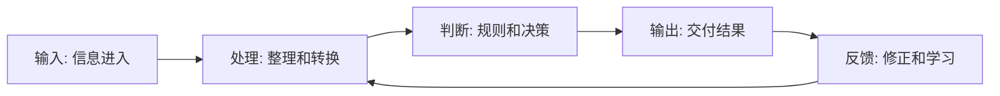

# AI 工作流为什么是 FDE 的核心场景？

AI 最容易被误用成一个“更聪明的聊天框”。

聊天框当然有价值，但如果 AI 只停留在问答界面，它改变的通常是个人操作习惯，而不是组织运行方式。企业真正关心的是：信息能不能更快流动，判断能不能更稳定，重复劳动能不能减少，关键流程能不能更透明。

这也是 AI 时代一个很有意思的变化：技术越来越像人，但真正难的部分反而越来越像组织工程。模型可以回答问题，但它不会自动知道这个答案应该进入哪条流程、由谁确认、出了错谁负责。

这也是为什么 AI 工作流会成为 FDE 的核心场景。

所谓 AI 工作流，是指把 AI 能力嵌入一组连续业务活动中，让它在信息获取、内容生成、判断辅助、任务分发、异常提醒或反馈学习等环节发挥作用。它不是单个提示词，也不是一个聊天窗口，而是一套人、模型、系统和规则共同完成工作的机制。

一个成熟的 AI 工作流通常包含五个要素：稳定输入、明确处理逻辑、可解释输出、人工确认边界和持续反馈机制。FDE 的价值就在于把这些要素放进真实组织，而不是只停留在模型调用层。

> **一句可以带走的判断：AI 不进入工作流，就只是工具；AI 进入工作流，才可能变成组织能力。**

## 单点工具为什么不够？

很多团队刚开始用 AI，会先从单点工具入手：写文案、总结会议、问知识库、生成报告。

这些工具能提高个人效率，但很难自然变成组织效率。原因是组织效率不是由某个单点动作决定的，而是由一整条链路决定的。

比如“日报生成”看起来是写作问题，但真实链路可能包括：

- 数据从哪里来。
- 指标口径是否一致。
- 异常由谁解释。
- 观点由谁确认。
- 报告发给谁。
- 后续行动是否被追踪。

如果只让 AI 帮忙写最后一段文字，前面的数据、判断和反馈仍然混乱，效率提升会很有限。

## 工作流视角：五个环节

FDE 看 AI 场景时，通常不会先问“能不能用模型做”，而是先看工作流。

一个可改造的 AI 工作流，通常可以拆成五个环节：

不同 AI 能力适合进入不同环节：

| 环节 | AI 可以做什么 | 人必须保留什么 |
| --- | --- | --- |
| 输入 | 抓取、摘要、分类、结构化 | 定义来源和可信边界 |
| 处理 | 清洗、归纳、聚类、补全 | 判断异常和业务语境 |
| 判断 | 生成建议、风险提示、优先级排序 | 承担关键决策责任 |
| 输出 | 生成文档、回复、任务、报告 | 审核高风险内容 |
| 反馈 | 收集失败样本、总结模式 | 调整目标和规则 |

AI 工作流的关键不是“让 AI 全自动”，而是把 AI 放在合适的位置。

## FDE 如何识别适合改造的 AI 工作流？

不是所有流程都适合 AI。

FDE 会优先寻找几类场景：

- 高频重复，但每次都有轻微差异。
- 信息来源多，需要整理和判断。
- 有明确输出，比如报告、回复、决策建议、任务分发。
- 当前依赖少数人的经验。
- 错误成本可控，或能设计人工确认。
- 改造后能看到业务指标变化。

比如“每日行业趋势雷达”就是一个典型 AI 工作流：确定关键词和信息源，自动抓取内容，去重分类，生成趋势摘要，再输出日报或选题建议。它不是一个单点工具，而是一条从信息输入到业务输出的链路。

## 人机边界是工作流设计的核心

AI 工作流最容易出问题的地方，是边界设计。

很多团队会在两个极端之间摇摆：要么只让 AI 做无关紧要的小事，要么希望 AI 全自动替代人。FDE 更关注中间地带：哪些部分可以自动化，哪些部分应该由 AI 辅助，哪些部分必须由人确认。

| 工作类型 | 建议处理方式 |
| --- | --- |
| 信息收集、初步分类 | 可较多自动化 |
| 摘要、草稿、建议生成 | AI 生成 + 人审核 |
| 高风险业务判断 | AI 辅助 + 人负责 |
| 不可逆操作 | 默认人工确认 |
| 规则更新和目标定义 | 人负责，AI 提供证据 |

> **AI 工作流的成熟标志，不是自动化比例最高，而是人和 AI 的责任边界最清楚。**

## 结尾判断框架

判断一个 AI 场景是不是值得做成工作流，可以问五个问题：

| 问题 | 如果答案是“是” |
| --- | --- |
| 它是否高频发生？ | 有自动化价值 |
| 它是否依赖多源信息？ | 有 AI 整理价值 |
| 它是否需要判断而不是机械执行？ | 有 AI 辅助价值 |
| 它是否有明确输出？ | 能形成闭环 |
| 它是否能通过反馈持续变好？ | 有产品化潜力 |

如果一个 AI 场景只能生成一次结果，却无法进入输入、处理、判断、输出和反馈的循环，它更像工具；如果它能改变这条循环，它才是 FDE 值得投入的工作流。

所以，FDE 看 AI，不是先看“它能不能回答”，而是看“它能不能被组织接住”。这条分水岭，比模型参数更重要。
