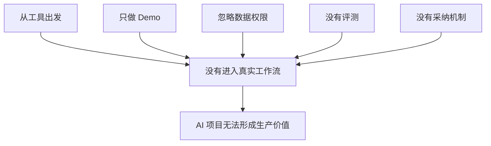

# 企业 AI 落地最常见的 5 个坑

一个企业做知识库问答，Demo 阶段人人看完都说好。

上线后，真实用户却很少打开。有人说答案不够准，有人说入口太远，有人说高风险问题还是不敢让 AI 回答。最后系统还在，使用却慢慢冷掉。

企业 AI 项目失败，很多时候不是因为模型不够强。

更常见的情况是：团队做出了一个看起来很聪明的东西，但它没有进入真实流程，没有被用户持续使用，没有形成质量控制，也没有人能说清楚它到底创造了什么业务结果。

这几年很多企业都经历过类似路径：先被 Demo 点燃，再被上线打醒。演示时 AI 像一个未来入口，落地时才发现，真正挡路的是数据、权限、组织、评测和责任。

所谓“企业 AI 落地”，不是采购模型、搭建知识库或上线一个助手这么简单。更准确地说，它是把 AI 能力部署到真实业务流程中，并让这套能力在数据治理、权限控制、质量评测、用户采用和持续运营的约束下创造可衡量结果。

因此，企业 AI 落地失败往往不是单点技术失败，而是系统性落地失败：模型能用，但数据不可信；功能能演示，但流程接不上；输出像答案，但没人敢负责；项目上线了，但组织没有形成新的工作方式。

> **一句可以带走的判断：AI 项目最怕的不是不智能，而是聪明得很热闹，落地得很空。**

## 一句话定义

企业 AI 落地，是把 AI 能力部署到真实业务流程中，并让它在数据治理、权限控制、质量评测、用户采用和持续运营的约束下创造可衡量结果。

所以它不是单点工具上线，而是一套组织能力建设。

## 坑一：从工具出发，而不是从工作流出发

很多项目一开始就问：我们要不要做 RAG？要不要做 Agent？要不要接某个大模型？

这些问题都可以问，但不应该第一个问。第一个问题应该是：我们要改变哪条工作流？

从工具出发，容易做出“功能有了，但没人刚需”的系统。从工作流出发，才会看到真实瓶颈：信息在哪里断、判断在哪里慢、责任在哪里不清、反馈在哪里消失。

| 错误起点 | 更好的起点 |
| --- | --- |
| 我们要做一个 AI 助手 | 哪个岗位的哪条流程最需要助手 |
| 我们要做知识库问答 | 哪类问题最常被重复询问 |
| 我们要做自动报告 | 哪个决策因为报告慢而受影响 |

---

## 实战拆解：知识库问答为什么上线后没人用

回到开头那个知识库问答项目。

表面看，问题是“用户不愿意用 AI”。

但往下拆，通常会看到更具体的原因：

| 现象 | 背后的坑 |
| --- | --- |
| 用户不知道什么时候该问 AI | 没有嵌入工作流 |
| 回答有时不准 | 没有评测集和失败样本 |
| 高风险问题仍然问主管 | 人工确认边界不清 |
| 知识库越来越旧 | 没有 Owner 和更新机制 |
| 管理层看不到价值 | 没有业务指标和采用数据 |

这就是企业 AI 落地的典型失败路径：工具存在，但组织没有形成新的工作方式。

## 坑二：只做 Demo，不设计生产路径

Demo 很容易让人兴奋。它能回答问题、生成内容、跑通流程，看起来已经离上线不远。

但如果 Demo 阶段没有记录哪些约束被绕开，后面会非常痛苦。临时账号、手工数据、离线脚本、未审计权限、没有失败样本，这些都会在生产化时变成债。

FDE 的做法是：Demo 一开始就要标注哪些是真能力，哪些是临时方案，哪些风险还没验证。

> **Demo 不是生产系统的幼年版，而是生产方向的验证工具。**

## 坑三：忽略数据、权限和系统集成

AI 项目经常在模型层面讨论很多，但在数据和权限层面准备不足。

企业里的数据不是一池干净的水。它分散在系统、表格、文档、群聊、人工经验里，还受权限、合规、审计和部门边界约束。

一个 AI 系统如果不能处理这些边界，就很难进入生产。

| 被忽略的问题 | 可能后果 |
| --- | --- |
| 数据口径不一致 | AI 输出看似合理但业务不认 |
| 权限过滤不清楚 | 越权读取或泄露敏感信息 |
| 系统接口不稳定 | 流程无法持续运行 |
| 审计缺失 | 合规无法通过 |

## 坑四：没有评测标准，只凭体感判断

很多 AI 项目上线前只看几次演示：回答不错、总结挺好、用户说可以。

这不够。

AI 输出会随着提示词、知识库、模型版本、业务规则变化而变化。没有评测集和回归机制，团队很难知道系统什么时候变差，也很难解释一次变更影响了哪些场景。

FDE 会把真实任务、失败样本和业务验收标准纳入评测，而不是只看通用榜单或主观体验。

## 坑五：没有组织采纳和运营机制

系统做出来，不等于组织会用。

很多 AI 工具失败，是因为它没有进入用户原来的工作入口，或者没有明确责任人。用户需要多打开一个页面、多复制一次内容、多承担一次判断风险，最后自然就不用了。

生产 AI 系统必须回答：

- 谁每天使用？
- 在哪个流程节点使用？
- 用户不采纳怎么办？
- 反馈如何回流？
- 谁维护知识和规则？
- 谁对错误和风险负责？

## 五个坑背后的同一个问题

这五个坑看起来不同，其实指向同一件事：企业 AI 不是模型采购问题，而是现场部署问题。

## 结尾判断框架

判断一个 AI 项目是不是踩坑，可以问五个问题：

| 问题 | 如果答不上来 |
| --- | --- |
| 它改变的是哪条工作流？ | 可能只是工具堆砌 |
| Demo 到生产的路径是什么？ | 可能只能演示 |
| 数据和权限边界在哪里？ | 可能无法上线 |
| 如何评测质量变化？ | 可能靠体感运行 |
| 谁负责用户采纳和运营？ | 可能没人真的用 |

五个问题都能回答，AI 项目才从“有点聪明”走向“真的有用”。

AI 落地不是把聪明能力塞进企业，而是让企业有能力消化这种聪明。FDE 的价值，就在这个消化过程里。
