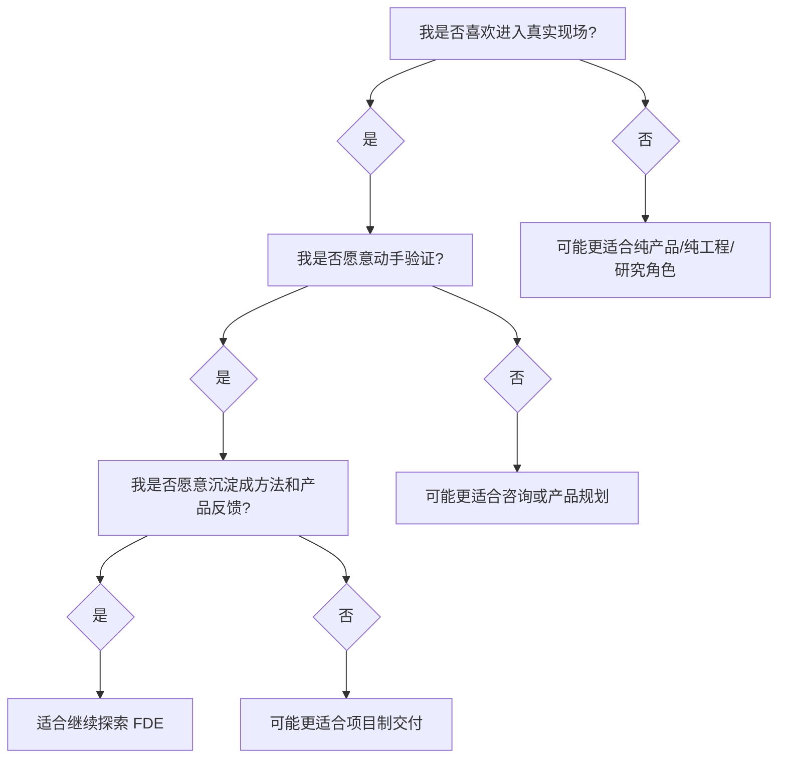

# 普通人如何判断自己适不适合做 FDE？

先说一个可能有点扎心的判断：不是代码写得好，就一定适合做 FDE。

FDE 听起来像一个门槛很高的角色：要懂业务，要懂技术，要能沟通，还要能在客户现场扛住不确定性。这确实不是一个轻松角色。但它也不是只有“顶尖全栈工程师”才能碰的方向。很多产品、工程、咨询、解决方案、运营背景的人，都可能有一部分可迁移能力。

关键不是你现在是不是完整的 FDE，而是你是否适合往这个方向长。换句话说，要看的不是你已经会什么，而是你愿不愿意进入那种模糊、混乱、需要自己找路的现场。

更专业一点说，FDE 适配度不是单一技能测试，而是角色倾向测试。它考察的是一个人是否愿意长期处在业务、工程、客户和产品之间，是否能把不确定问题推进成可验证系统，是否能在速度、质量、边界和结果之间做判断。

因此，判断自己适不适合 FDE，不能只问“我技术够不够强”，还要问“我是否愿意承担问题定义、现场沟通、工程验证和结果复盘这一整条链路”。

> **一句可以带走的判断：适合 FDE 的人，不一定一开始什么都会，但一定不害怕跨出自己的专业舒适区。**

## 适合 FDE 的几个信号

第一，你对真实业务现场有好奇心。

你不满足于听需求，而是想知道用户到底怎么工作，为什么流程会变成这样，哪些规则写在系统里，哪些规则藏在人脑里。

第二，你愿意动手验证。

你不只想讨论方向，也愿意搭一个原型、接一段数据、跑一个实验，用结果推动讨论。

第三，你能接受不确定性。

FDE 很少面对一开始就清晰的任务。需求会变，现场会暴露新问题，客户会提出矛盾目标。你需要在变化中逐步收敛，而不是等所有条件完美。

第四，你有边界感。

适合 FDE 的人不是“客户说什么都做”，而是能判断什么该做、什么该拒绝、什么该产品化、什么只是一次性定制。

第五，你愿意把经验沉淀出来。

FDE 的复利来自沉淀。如果你做完一个项目，只想赶紧进入下一个项目，不愿意复盘、写模板、提炼模式，那会很难形成长期优势。

## 不太适合的信号

也有一些信号说明你可能暂时不适合 FDE。

| 信号 | 可能的问题 |
| --- | --- |
| 只想在明确需求下执行 | FDE 早期问题往往不明确 |
| 不愿面对客户和组织沟通 | 现场协作是核心工作 |
| 只追求技术优雅 | 现场项目常常要在约束中取舍 |
| 害怕暴露失败样本 | FDE 需要用失败推进学习 |
| 不愿做复盘沉淀 | 很难形成产品和平台反哺 |

这些不是永久标签，而是提醒你需要补哪些能力。

## 不同背景的人怎么转？

### 产品经理背景

优势是用户理解、场景判断、优先级和沟通能力。短板通常在工程实现深度、系统边界和生产化意识。

建议补：接口、数据流、权限、安全、AI 应用架构、基础工程交付。

### 工程师背景

优势是系统实现、技术判断和问题排查。短板通常在业务发现、用户共情、产品抽象和商业目标理解。

建议补：业务访谈、流程建模、需求切片、客户沟通、产品化思维。

### 咨询/解决方案背景

优势是结构化表达、客户沟通、业务诊断和方案设计。短板通常在动手验证、工程细节和生产责任。

建议补：原型开发、数据接入、AI 工具链、评测和上线交付。

### 运营/业务背景

优势是熟悉现场流程、知道真实痛点、能理解组织惯性。短板通常在技术抽象和系统化表达。

建议补：产品思维、基础自动化、数据分析、AI 工作流设计。

## 三个自测问题

更直接地问自己：

| 问题 | 如果答案是“是” |
| --- | --- |
| 我是否愿意坐到用户旁边，看他真实怎么工作？ | 有现场发现潜力 |
| 我是否愿意用原型而不是争论推进共识？ | 有工程验证潜力 |
| 我是否愿意把一次项目经验整理成下次可复用的东西？ | 有产品反哺潜力 |

## 结尾判断框架

判断自己适不适合 FDE，不要只看“我会不会写代码”。

可以看三种倾向：

| 倾向 | 更适合 FDE |
| --- | --- |
| 面对模糊问题 | 愿意进入现场澄清，而不是等需求文档 |
| 面对技术方案 | 愿意动手验证，而不是只停在讨论 |
| 面对项目结果 | 愿意沉淀复用，而不是做完就走 |

如果这三点你都不排斥，甚至有点兴奋，那 FDE 值得继续探索。

反过来，如果你更喜欢清晰需求、稳定边界、少和人打交道，也没问题。那不是能力差，而是角色不匹配。FDE 不是更高级的职业，只是一条更靠近现场、更靠近不确定性的路。
