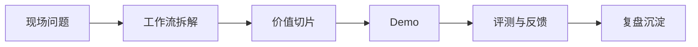

# FDE 入门资料和学习路径

很多人学 FDE 的第一反应，是打开一堆资料：Palantir、OpenAI、RAG、Agent、SRE、平台工程、咨询方法、产品管理。

越看越焦虑。

因为每个方向都像有关系，但又不知道应该先学哪个。

FDE 的入门难点，不是资料太少，而是资料太散。

你可能会看到 Palantir、OpenAI、企业 AI、RAG、Agent、SRE、平台工程、咨询、产品管理、客户成功、交付管理，每个方向都和 FDE 有关系。但如果一开始全都学，很容易变成“什么都知道一点，但不知道怎么用”。

所以学习 FDE 不能像补课一样横向堆技能。更好的方式，是围绕一个小闭环训练：发现一个真实问题，把它切成可验证场景，做出 Demo，再补评测、反馈和复盘。

从知识体系上看，FDE 学习可以分成四层：角色认知、现场方法、工程交付和生产治理。角色认知解决“FDE 是什么，不是什么”；现场方法解决“如何发现真实问题”；工程交付解决“如何把问题做成系统”；生产治理解决“如何让系统可运行、可审计、可接管”。

这四层不是并列课程，而是一条递进路径。先理解角色边界，再训练现场问题发现，再用 Demo 验证价值，最后补齐生产化所需的数据、权限、评测和运维能力。

> **一句可以带走的判断：FDE 的学习路径，不是横向堆技能，而是围绕“从现场问题到生产系统”建立能力链。**

## 一句话定义

FDE 的学习路径，应该围绕一条完整能力链展开：理解角色边界，发现真实问题，切出价值闭环，做 Demo 验证，补齐生产化，再沉淀为作品和方法。

不要一开始横向堆工具。

先练一条从现场问题到生产系统的闭环。

## 第一阶段：先理解角色边界

不要一上来就学工具。

第一阶段要先弄清楚 FDE 和咨询、外包、售前、产品经理、解决方案、交付工程师的区别。否则你学了很多技能，也不知道它们在 FDE 工作中放在哪里。

---

## 实战拆解：用一个小项目练 FDE

最适合入门的方式，不是先学完所有理论。

而是选一个你身边真实存在的小流程，比如会议纪要、客户跟进、内容选题、日报汇总、知识库维护。

然后按 FDE 的方式走一遍：

- 先访谈 2-3 个真实使用者。
- 写清楚当前流程的输入、处理、判断、输出和反馈。
- 找到一个最小但完整的价值切片。
- 做一个粗糙 Demo。
- 收集失败样本。
- 写一份复盘：哪些假设成立，哪些被推翻。

这比单纯看十篇工具教程更有效。

因为 FDE 学的不是“会不会用某个工具”，而是能不能把一个真实问题推进成可验证系统。

这一阶段建议重点理解三件事：

- FDE 为什么出现。
- FDE 和相邻角色的分水岭。
- FDE 的价值闭环：现场发现、工程验证、生产采用、产品反哺。

## 第二阶段：学习现场问题发现

FDE 的第一项硬功夫，是发现真实问题。

这阶段可以练习：

- 访谈业务负责人。
- 观察一线工作流。
- 拆解输入、处理、判断、输出、反馈。
- 区分事实、愿望和假设。
- 把模糊痛点切成可验证问题。

可以从自己熟悉的工作场景练起，比如日报、客户跟进、内容生产、会议纪要、社群运营、销售线索、知识库维护。

## 第三阶段：学习 Demo 和价值切片

FDE 不会一开始做完整系统，而是先找到一个最小但完整的价值闭环。

这一阶段要学会：

- 写用户故事。
- 定义验收条件。
- 识别关键假设。
- 做最小原型。
- 收集失败样本。
- 判断继续、缩小还是停止。

> **一个好 Demo，不是功能最多，而是最早暴露关键风险。**

## 第四阶段：补 AI 工作流和生产化

AI 时代的 FDE，必须理解 AI 不是单点工具，而是工作流能力。

这一阶段重点补：

| 能力 | 要理解什么 |
| --- | --- |
| RAG | 企业知识如何安全接入模型 |
| Agent | 工具调用和执行边界如何设计 |
| 评测 | AI 输出如何验收、回归和追踪 |
| 权限 | 模型能看什么、能做什么 |
| 人机协同 | 哪些判断交给 AI，哪些必须人工确认 |
| 生产化 | 监控、回滚、成本、审计、接管 |

不需要一开始变成大模型专家，但要知道 AI 系统进入企业现场后会遇到哪些工程问题。

## 第五阶段：补工程、数据、安全和运维底座

FDE 不一定是最深的基础设施专家，但不能完全不懂工程底座。

建议按使用场景补，而不是按教科书顺序补：

- 接系统：API、Webhook、数据库、身份认证。
- 接数据：数据源、数据质量、血缘、权限。
- 部署运行：容器、环境、日志、监控、告警。
- 安全治理：最小权限、审计、数据分级、敏感信息。
- 交付协作：版本、回滚、验收、运行手册。

学这些不是为了炫技，而是为了判断方案能不能进生产。

## 第六阶段：做一个小型 FDE 作品

最好的入门方式，是做一个完整小案例。

你可以选一个自己熟悉的工作流，例如：

- 每日行业趋势雷达。
- 销售线索优先级助手。
- 客户反馈分类与复盘。
- 会议纪要到任务跟进。
- 内容选题到发布复盘。
- 企业知识库问答与更新提醒。

作品不需要很大，但要完整：

## 推荐练习清单

| 练习 | 目标 |
| --- | --- |
| 画一条真实工作流 | 训练现场理解 |
| 找 3 个流程断点 | 训练问题发现 |
| 写一个价值切片 | 训练范围控制 |
| 做一个低保真 Demo | 训练验证能力 |
| 建一个失败样本表 | 训练评测意识 |
| 写一页复盘 | 训练产品反哺 |

## 结尾学习路线

如果你只有 30 天，可以这样安排：

| 时间 | 学习重点 | 产出 |
| --- | --- | --- |
| 第 1 周 | 理解 FDE 角色和边界 | 一页角色对比表 |
| 第 2 周 | 拆一个真实工作流 | 工作流图 + 问题清单 |
| 第 3 周 | 做一个最小 Demo | 可演示原型 + 失败样本 |
| 第 4 周 | 补评测和复盘 | 判断框架 + 复盘文档 |

FDE 的入门不是背概念，而是训练一种路径：从现场进入问题，从问题进入系统，从系统进入生产，从生产回到产品学习。

这也是为什么 FDE 看起来像一个岗位，实际更像一套训练。AI 会替你写越来越多代码，但不会替你判断什么问题值得做、什么结果算有效、什么责任必须有人接住。

走完这个小闭环，你就已经开始理解 FDE 了。
