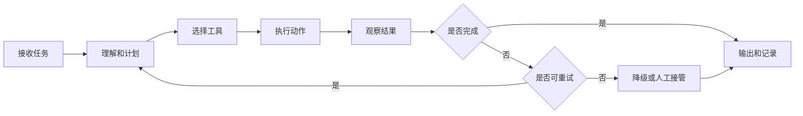

# Agent 进入生产前要检查什么

Agent 最容易让人兴奋，也最容易让人低估风险。

一个聊天助手回答错了，用户可能只是重新问一遍；一个 Agent 如果调用了工具、写入了系统、触发了流程，它的错误就可能变成真实业务动作。

所以在 FDE 项目里，Agent 不能只被看成“更聪明的助手”。一旦它能计划、调用工具、执行任务、修改状态，它就已经接近一个受控行动系统。

从定义上看，生产级 Agent 是一类能在指定目标、权限和状态边界内，使用模型推理和工具调用完成任务的系统。它必须有清晰的输入、状态、工具权限、评测标准、执行日志、人工接管和回滚机制。

> **一句可以带走的判断：Agent 进入生产前，最重要的不是它能做多少事，而是它被允许做什么，以及做错了怎么办。**

## Agent 不是聊天助手，而是受控行动系统

聊天助手主要输出信息，Agent 可能改变状态。

这一区别非常关键。

| 类型 | 主要动作 | 主要风险 |
| --- | --- | --- |
| 聊天助手 | 回答、总结、解释 | 答错、幻觉、误导 |
| 工作流助手 | 生成建议、填表、分类 | 质量不稳、人工负担增加 |
| Agent | 调工具、执行动作、更新系统 | 越权、误操作、成本失控、责任不清 |

Agent 越接近生产流程，越不能只看模型效果，而要看系统控制。

## 状态机要先画清楚

生产级 Agent 不能是一团自由推理。

它至少应该有状态机。也就是说，团队要知道它从接到任务到结束任务，会经历哪些状态，每个状态允许做什么，失败时怎么处理。

一个基础状态机可以是：

状态机的价值，是防止 Agent 在模糊目标下无限尝试，也防止团队不知道它到底在哪里失败。

## 工具权限要分级

Agent 最大的生产风险，往往来自工具调用。

建议把工具权限分成四级：

| 权限等级 | 含义 | 示例 |
| --- | --- | --- |
| 只读 | 只能查询，不改变状态 | 查询订单、读取知识库 |
| 建议 | 生成建议，但不执行 | 推荐回复、生成跟进计划 |
| 审批后写入 | 人确认后执行写入 | 更新 CRM、创建工单 |
| 自动写入 | Agent 可直接执行 | 自动打标签、发送低风险通知 |

早期试点尽量从只读和建议开始。只有当评测、日志、回滚和责任边界都成熟后，才逐步开放写入能力。

## 生产前检查清单

Agent 上生产前，至少检查八类问题。

| 类别 | 检查问题 |
| --- | --- |
| 目标边界 | Agent 的任务范围是否清楚，哪些明确不做 |
| 工具权限 | 每个工具是只读、建议、审批后写入还是自动写入 |
| 身份权限 | Agent 以谁的身份访问系统，是否继承用户权限 |
| 评测集 | 是否覆盖正常样本、边界样本和失败样本 |
| Trace | 每次计划、调用、输入、输出是否可追踪 |
| 成本和限流 | 是否有 token、调用次数、并发和预算限制 |
| 安全合规 | 是否有敏感信息过滤、审计和越权防护 |
| 人工接管 | 什么时候停下来，谁接手，如何恢复 |

这些不是上线后的优化项，而是进入生产前的基本条件。

## 常见失败模式

FDE 在 Agent 项目中要提前识别失败模式。

| 失败模式 | 表现 | 防护方式 |
| --- | --- | --- |
| 目标误解 | Agent 按错误目标执行 | 任务模板、人工确认 |
| 工具误用 | 调错接口或参数 | 工具 schema、沙箱验证 |
| 权限越界 | 读取或写入不该访问的数据 | 身份继承、权限过滤 |
| 循环执行 | 反复重试导致成本失控 | 最大步数、限流、终止条件 |
| 静默失败 | 执行失败但用户不知道 | 状态反馈、告警 |
| 错误写入 | 修改业务系统产生影响 | 审批后写入、回滚 |
| 责任不清 | 出错后没人处理 | Owner 表、运行手册 |

Agent 越自动，越需要这些边界。

## 一个案例：自动创建工单 Agent

假设企业希望做一个 Agent，根据客服对话自动创建工单，并补充问题分类、优先级和建议处理人。

Demo 阶段，它可以直接生成工单内容，看起来很有效。

但生产前要问：

- 它是否能读取完整对话，还是只能读取脱敏摘要？
- 它能直接创建工单，还是需要客服确认？
- 分类错误会不会影响 SLA？
- 重复创建工单如何识别？
- 工单创建失败如何反馈？
- 每次分类依据是否可追溯？
- 哪些高风险工单必须人工确认？

更稳妥的路径通常是：先只生成建议，再人工确认创建；等采纳率和错误率稳定后，再开放低风险类别的自动创建。

## 生产准入表

| 准入项 | 最低要求 |
| --- | --- |
| 任务边界 | 有明确任务说明和不做事项 |
| 工具清单 | 每个工具有权限等级和调用限制 |
| 评测报告 | 至少覆盖关键正例、反例和边界样本 |
| Trace | 能回放每次计划和工具调用 |
| 人工接管 | 有明确触发条件和 Owner |
| 回滚方案 | 错误写入或异常执行可恢复 |
| 运行指标 | 成功率、失败率、延迟、成本可观测 |

Agent 是 AI 时代非常重要的能力形态，但它越强，越不能只靠直觉上线。

FDE 的任务不是阻止 Agent 进入生产，而是让它以可控、可审计、可接管的方式进入生产。
