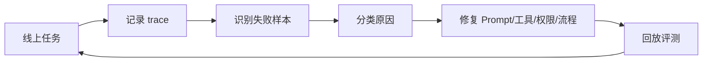

# Agent 运营体系：上线只是开始

一个销售跟进 Agent 上线后，第一周看起来很顺。

任务成功率不低，销售也愿意试。但继续往下看，团队发现采纳率只有一半左右，很多建议被销售手动改写，还有几类高价值客户场景始终效果不稳。

这时就会明白一件事：

Agent 上线之后，工作才真正开始。

传统软件上线后，主要看可用性、性能和缺陷；Agent 上线后，还要看任务成功率、工具调用质量、模型输出漂移、成本波动、人工接管比例和用户信任。

从定义上看，Agent 运营体系是一套围绕生产级 Agent 的持续监控、评测、反馈、优化和治理机制。它的目标不是让 Agent 永远自动运行，而是让 Agent 在可控边界内持续变好。

> **一句可以带走的判断：Agent 上线不是终点，而是从构建问题进入运营问题。**

## 一句话定义

Agent 运营体系，是一套围绕生产级 Agent 的持续监控、评测、反馈、优化和治理机制。

它的目标不是让 Agent 永远自动运行，而是让 Agent 在可控边界内持续变好。

## Agent 运营看什么

| 指标 | 说明 |
| --- | --- |
| 任务成功率 | Agent 是否完成目标任务 |
| 工具调用成功率 | 是否选对工具、参数是否正确 |
| 人工接管率 | 哪些场景需要人介入 |
| 用户采纳率 | 输出是否被实际采用 |
| 失败样本类型 | 错误集中在哪些模式 |
| 成本和延迟 | 是否出现异常消耗 |
| 权限告警 | 是否有越权或异常访问 |

Agent 运营不能只看“有没有报错”。很多 Agent 失败是静默的：它看起来完成了任务，但业务结果不可用。

## 失败样本闭环

Agent 运营最重要的是失败样本闭环。

流程可以是：

没有失败样本闭环，Agent 会在生产中慢慢劣化。

## 运营分工

Agent 运营不是 FDE 一个人的事。

| 角色 | 责任 |
| --- | --- |
| FDE | 判断失败模式和优化方向 |
| 业务 Owner | 确认输出是否符合业务要求 |
| 平台/SRE | 监控稳定性、成本和告警 |
| 安全/合规 | 复查权限和审计 |
| 产品团队 | 抽象共性问题和能力 |

如果所有问题都回到 FDE 身上，Agent 就没有真正被组织接管。

## 运营节奏

可以按三个周期运营：

| 周期 | 动作 |
| --- | --- |
| 每日 | 看失败任务、成本异常、告警 |
| 每周 | 回放评测集、复盘用户反馈 |
| 每月 | 评估是否扩大权限、抽象产品能力 |

Agent 的权限也应该随着运营证据逐步开放，而不是一开始就全自动。

## 一个例子

销售跟进 Agent 上线后，第一周任务成功率 80%，但销售采纳率只有 45%。

运营分析发现：

- Agent 对客户背景总结准确。
- 下一步建议太泛。
- 高价值线索和普通线索没有区分。
- 销售经常手动改写建议。

下一步不是简单换模型，而是补充线索分层规则、把销售修改内容回流评测集，并把高价值客户场景单独建测试样本。

Agent 运营的本质，是把“线上真实使用”变成下一轮改进的燃料。

---

## 实战拆解：销售采纳率为什么比任务成功率更重要

回到开头那个销售跟进 Agent。

如果只看任务成功率，系统看起来已经不错。

但 FDE 更关心的是：

- 销售有没有真的采用建议。
- 高价值线索场景是不是仍然不信任 Agent。
- 人工改写集中发生在哪些模式。
- 这些修改能不能回流成下一轮评测样本。

这就是 Agent 运营和普通上线监控的区别。

普通系统更关心“服务挂没挂”，Agent 系统还要关心“结果有没有被人真正用起来”。

## 最后判断

Agent 上线不是终点，而是运营的起点。

传统系统上线后主要看稳定性，Agent 上线后还要看采纳、修改、失败样本、工具调用、成本和边界问题。FDE 如果只负责把 Agent 做出来，不负责让它在真实使用中持续变好，Agent 很快就会从“智能系统”退化成没人信任的功能。
